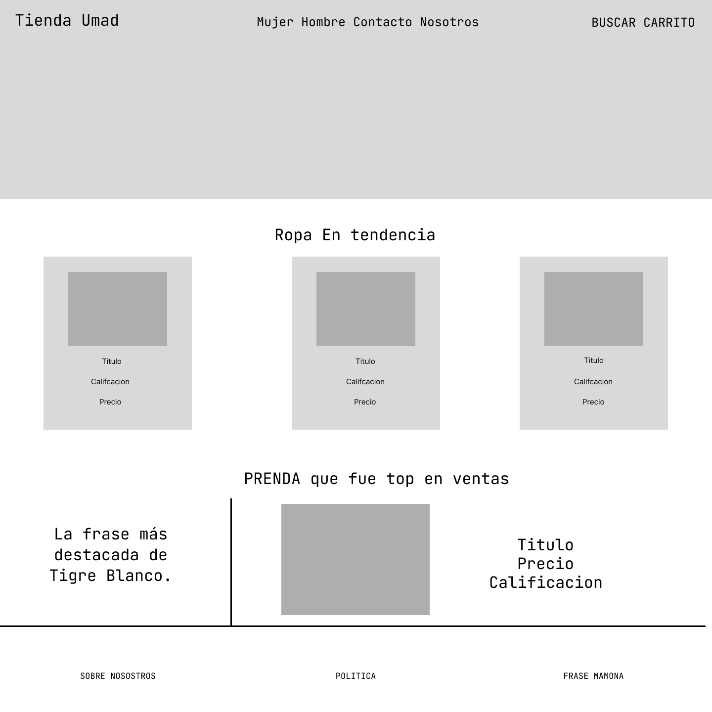
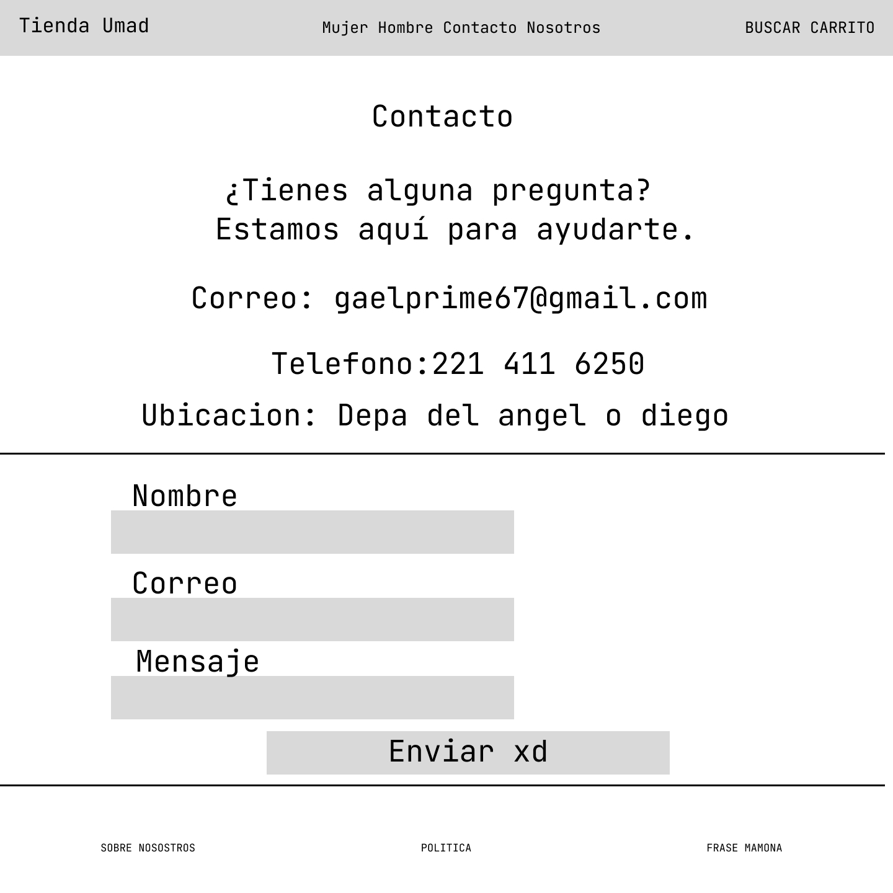
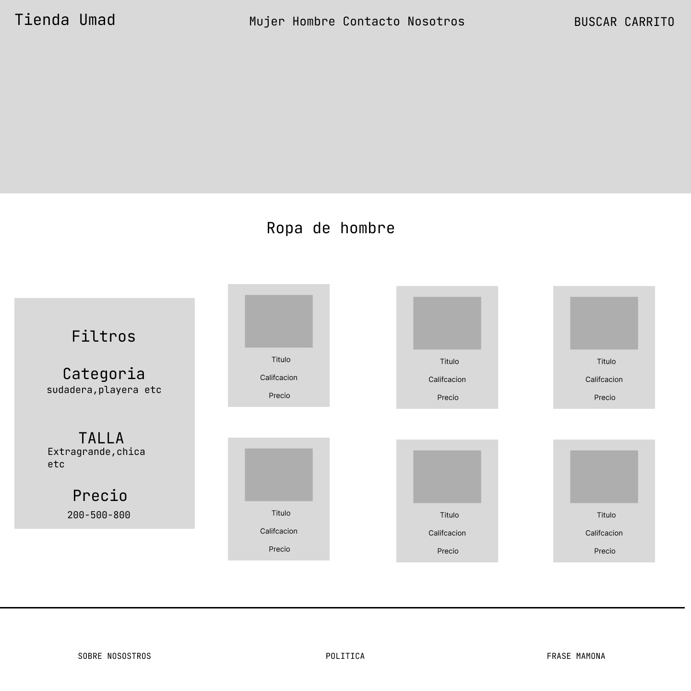
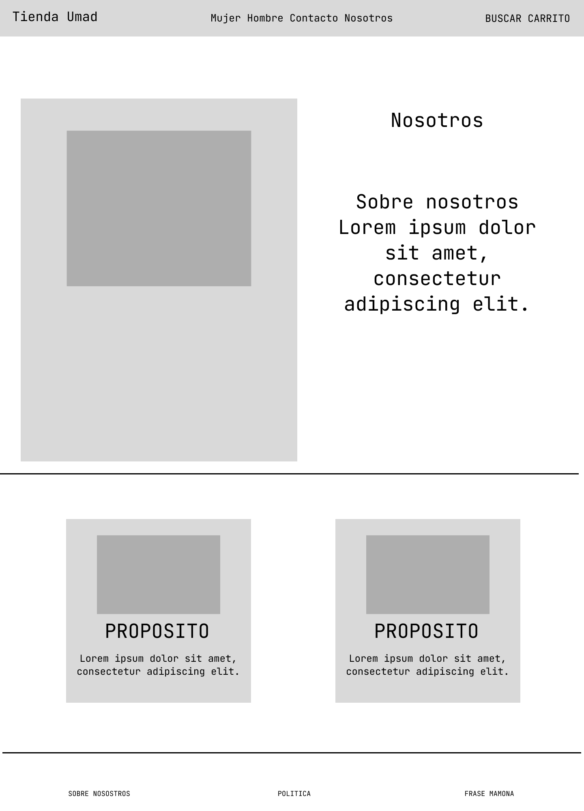
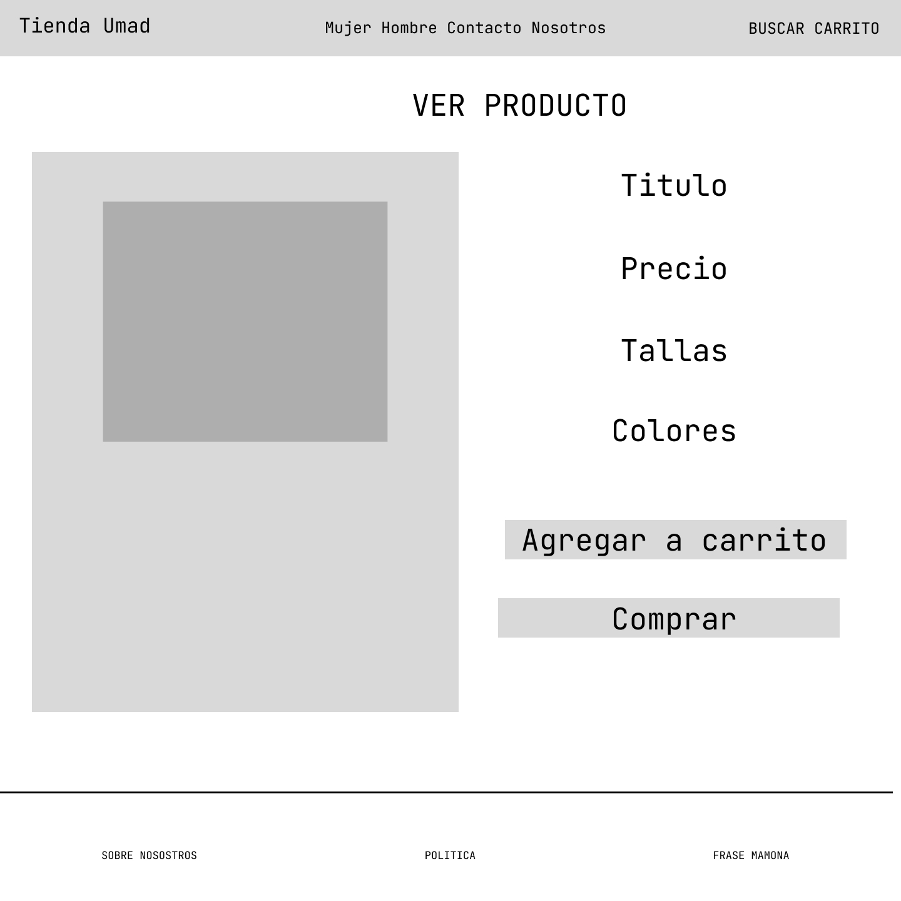

# Proyecto Ropa UMAD

### Descripción
Nuestro Proyecto Consiste en desarrollar una pagina web para la Tienda de ropa de la universidad madero, para que los estudiantes conozcan los diferentes productos que ofrece la universidad.

### 3. Tecnologías utilizadas

🟠 HTML

🔵 CSS

### 4. Requisitos previos
- Navegador web moderno (Chrome, Firefox, Safari, Edge)
- Editor de código (recomendamos VS Code)

### 5. Instalación
1. Clona este repositorio:

  -  **git clone** https://github.com/tu-usuario/tu-proyecto.git

2. Navega a la carpeta del proyecto:

   - cd tu-proyecto

3. Abre el archivo `index.html` en tu navegador
### 6. Uso
Para usar el proyecto primero se clona **el repositorio de git hub**. Una vez descargado, se debe abrir la carpeta del proyecto y ejecutar el archivo ***index.html***
### 7. Características
- Uso del hover
- Uso de CSS para diseño de la pagina

### 8. Autores
| Autor        | Contacto     |
| ------------ | ------------ |
| Angel Omar Luna Castillo  | Oslug53@gmail.com |
| Samuel Cuatzo Conde | Samuelcuatzo@gmail.com |
| Diego Alberto Juarez Angulo | diegoangulo967@gmail.com |
| Gael Alejandro Cerrillo Escanero | gace220106@gmail.com |

## Imágenes del diseño de la página
<h3 >Index</h3>

<h3>Contacto</h3>

<h3>Ropa Hombre</h3>

<h3>Ropa Mujer</h3>

<h3>Nosotros</h3>

<h3>Ver Producto</h3>

